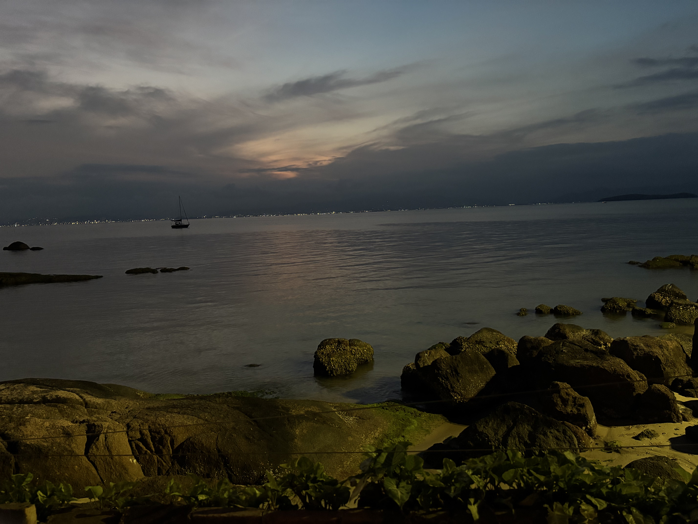
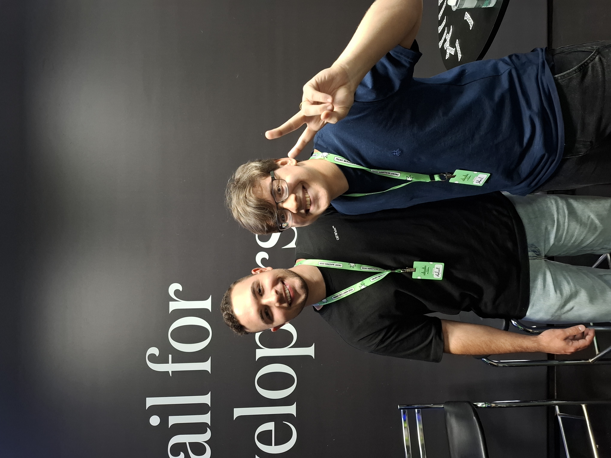

# My first conference

I've always considered myself an extrovert and I've always loved nerding out with anyone that would listen to me, so I've been loving watching the amazing talks for so many conferences recorded on YouTube. One of my top favorite ones is Dan Abramov's [The wet codebase](https://youtu.be/17KCHwOwgms?si=aP_G9SqSxxAz1xl7).

But, I've never really had the chance to attend any conference, not even in Brazil. Mostly because I grew up in a very small city of Pernambuco called Venturosa, in a low-income family that didn't get a whole lot of opportunities like this.

At first, I was invited to [CodeCon](https://codecon.dev/) that happened in Curitiba, but couldn't really attend at the time. But then, I heard about Front in Floripa, and couldn't help but think it was time. With no doubts in mind I asked if I could come, and with their thumbs up, started buying some flights.

## The day before

The day before the conference, which was a Friday, they planned for us all (Carolina, Carol, [Isabela](https://x.com/isabellaaq2), [João](https://x.com/jopcmelo), [Lucas](https://x.com/thewizardlucas), [Zeno](https://x.com/zenorocha), [and me!](https://x.com/gabrielmfern)) to have dinner together at a beautiful place by the sea called [Rosso](https://share.google/71hHgTzjbCE8UPngW).

There I ate some amazing seafood (though I was pretty conservative with the dishes lol), and appreciated the beautiful sight that was the sea beside it. The sea was the part that got me in the most awe, as a Christian, my understanding of this could only take me into the position of worship of God, truly.

    

Carol and Zeno were also generous enough to invite my wife to the dinner and she could meet everyone which I really loved.

## The people

For me, the most important part of the conference was the people, travel is just the price, and talks are a good conversation starter.

### João Melo

I think I talked to him the most, he also works at Resend and is one of the coolest developers I know. He mentioned that one of his side projects was an app called Vein that actually has people paying for it, but he's thinking about discontinuing it. I also talked to him about the stuff I'm making with Zig and asked if he was down to build some of it with me, and he was! Never got to the part of someone saying "yes" lol.

One really cool thing that happened was that we noticed a UI bug in the broadcasts editor in the video that was playing for the booth, and we fixed it together.

Also forgot to take a picture with him. D:

### Lucas da Costa

Lucas was actually one of the most popular people around Front In Floripa, which was kind of crazy, he also works at Resend, like João and me, and I was really happy to get to know him a bit more. His girlfriend Gabriela was also very nice and went there.

We nerded out about a lot of stuff like neovim, math, and some problems around programming like how every solution we pick is actually bad, how we repeat ourselves throughout history and generations and a lot more stuff. He also promised to get me a book about math for the Offsite we're having and I'll be waiting!

Unfortunately forgot to take a picture with him too :(

### Rafael Camargo

He was actually one of the speakers, I was extremely impressed by everything around him, and he's actually really young (like me), so it's much easier to relate in a conversation too. I talked to him about his talk, which led us to discussing his creation of a library specific to making slides in React that he used to make the talk, which sounds monumentally cool!

That also led me to sharing the stuff that I've been having fun doing with Zig playing around with terminal apps, and making a GUI framework.

Also took a picture with him:

    

### Erasmo Hernández

He was also one of the speakers, I wasn't able to catch his talk, but I'm sure it was great! We talked about Windsurf and particularly, about the state of Venezuela where he was born and his family lives in. It was really great, and he was also very nice.

Here's a picture I took with him:

    

### Guilherme Rodz

I love input-otp and the work and love he put into it. He's really nice, and I only overheard a bit of him talking about what he wants for his future, and how his life is in a place that he really likes right now. Also got a follow from him on Twitter, which was awesome!

Here's a picture I took with him:

    

### Mario Yuri

I wasn't able to talk to him a whole lot, but he's a really talented guy, around my age too, and had a lot of fun talking to him back in a happy hour Resend did in São Paulo.

Also took a picture with him:

    

### Paulo De Mitri

Paulo is a really awesome engineer that works at Vercel that I've been following for a really long time. This wasn't my first time meeting him, but it was still awesome. He gave me some praise about my work and that made me feel awesome because he's one of the engineers I admire a lot.

Wouldn't miss a picture with him:

    

## Coming back

    

What came everything around this was completely awesome. It was also so much better than I thought it would be, and I loved every moment of talking to everyone there. Thank you to Resend, to the organizers, to the people that nerded out with me and the people that heard me explaining what Resend was, too!

I loved talking to everyone there, and if I didn't mention you specifically, it doesn't mean I didn't love talking to you too. :)

Thanks for reading, and hope you have a great life! Here's me writing the conclusion to this while in the bus back home:

    

